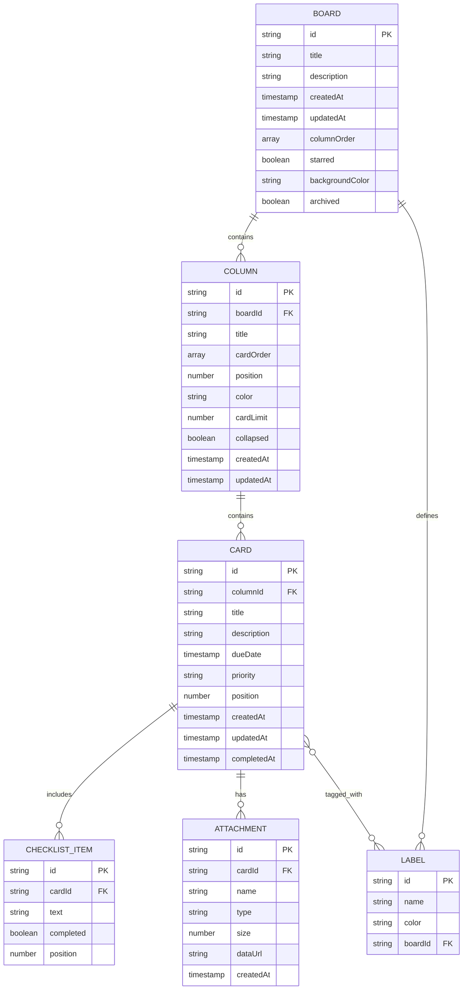

# Kanban Board Implementation Plan

## Executive Summary

This document outlines the comprehensive implementation strategy for a frontend-only Kanban board web application built with React. The application emphasizes modern UI/UX, smooth interactions, and client-side state management with local persistence. The design follows the Ocean Professional style guide with blue (#2563EB) and amber (#F59E0B) accent colors, implementing a clean, modern aesthetic.

## Project Overview

### Vision

A Trello-inspired Kanban board application that runs entirely in the browser, providing users with an intuitive, responsive interface for managing tasks across multiple boards and columns. The application prioritizes user experience through smooth drag-and-drop interactions, keyboard shortcuts, theme customization, and offline-first functionality.

### Key Characteristics

- **Frontend-Only**: No backend dependencies, all data stored locally
- **Modern Stack**: React 18+ with hooks-based architecture
- **Responsive Design**: Mobile-first approach with desktop enhancements
- **Accessibility First**: WCAG 2.1 AA compliance with comprehensive keyboard navigation
- **Performance Optimized**: Virtual scrolling, code splitting, and optimized rendering
- **Theme Support**: Light and dark modes with Ocean Professional styling

## Technology Stack

### Core Technologies

| Technology | Version | Purpose |
|------------|---------|---------|
| React | 18.2+ | UI framework and component architecture |
| React DnD | 16.0+ | Drag and drop functionality |
| Zustand | 4.4+ | Lightweight state management |
| IndexedDB (Dexie.js) | 3.2+ | Primary persistence layer |
| date-fns | 2.30+ | Date manipulation and formatting |
| React Router | 6.20+ | Client-side routing |
| Tailwind CSS | 3.4+ | Utility-first styling framework |

### Development Tools

| Tool | Purpose |
|------|---------|
| ESLint | Code linting and quality |
| Prettier | Code formatting |
| Jest | Unit testing framework |
| React Testing Library | Component testing |
| Cypress | End-to-end testing |
| Husky | Git hooks for quality gates |

### Rationale for Key Choices

**Zustand over Redux**: Lightweight, minimal boilerplate, excellent TypeScript support, and simpler learning curve while maintaining scalability.

**IndexedDB over localStorage**: Better performance for larger datasets, supports complex queries, no 5-10MB storage limit, and allows for future data migration strategies.

**React DnD over react-beautiful-dnd**: More flexible, better maintained, supports complex drag scenarios, and provides lower-level control for custom interactions.

**Tailwind CSS**: Aligns with modern development practices, provides utility classes that match the Ocean Professional theme, and enables rapid UI development.

## Architecture Overview

### High-Level Architecture

The application follows a layered architecture pattern with clear separation of concerns:

```
┌─────────────────────────────────────────────────────────┐
│                    Presentation Layer                    │
│  (React Components, UI Logic, Event Handlers)           │
└─────────────────────────────────────────────────────────┘
                           │
┌─────────────────────────────────────────────────────────┐
│                   State Management Layer                 │
│        (Zustand Stores, Actions, Selectors)             │
└─────────────────────────────────────────────────────────┘
                           │
┌─────────────────────────────────────────────────────────┐
│                    Business Logic Layer                  │
│   (Utilities, Validators, Transformers, Helpers)        │
└─────────────────────────────────────────────────────────┘
                           │
┌─────────────────────────────────────────────────────────┐
│                    Persistence Layer                     │
│       (IndexedDB Service, Storage Abstraction)          │
└─────────────────────────────────────────────────────────┘
```

### Component Architecture

The application follows an atomic design methodology with five levels of component abstraction:

**1. Atoms**: Basic building blocks (Button, Input, Label, Icon, Badge)

**2. Molecules**: Simple combinations (SearchBar, ColorPicker, DatePicker, ConfirmDialog)

**3. Organisms**: Complex UI sections (KanbanCard, KanbanColumn, BoardHeader, Sidebar)

**4. Templates**: Page layouts (BoardLayout, SettingsLayout)

**5. Pages**: Complete views (BoardPage, HomePage, NotFoundPage)

### Data Flow Pattern

The application implements unidirectional data flow:

```
User Action → Event Handler → Store Action → State Update → Component Re-render
                                    ↓
                            Persistence Layer
                            (Background Sync)
```

## Data Models

### Core Entities

#### Board Entity

```javascript
{
  id: string,                    // UUID v4
  title: string,                 // Board name (1-100 chars)
  description: string,           // Optional description (0-500 chars)
  createdAt: timestamp,          // ISO 8601 datetime
  updatedAt: timestamp,          // ISO 8601 datetime
  columnOrder: string[],         // Array of column IDs
  starred: boolean,              // Quick access flag
  backgroundColor: string,       // Hex color or gradient
  archived: boolean              // Soft delete flag
}
```

#### Column Entity

```javascript
{
  id: string,                    // UUID v4
  boardId: string,               // Foreign key to Board
  title: string,                 // Column name (1-50 chars)
  cardOrder: string[],           // Array of card IDs
  position: number,              // Sort order within board
  color: string,                 // Optional header color
  cardLimit: number,             // WIP limit (null = unlimited)
  collapsed: boolean,            // UI state flag
  createdAt: timestamp,          // ISO 8601 datetime
  updatedAt: timestamp           // ISO 8601 datetime
}
```

#### Card Entity

```javascript
{
  id: string,                    // UUID v4
  columnId: string,              // Foreign key to Column
  title: string,                 // Card title (1-200 chars)
  description: string,           // Rich text content (0-5000 chars)
  labels: Label[],               // Array of label objects
  dueDate: timestamp,            // ISO 8601 datetime or null
  priority: enum,                // 'low' | 'medium' | 'high' | 'critical'
  position: number,              // Sort order within column
  checklist: ChecklistItem[],    // Array of checklist items
  attachments: Attachment[],     // Array of attachment metadata
  createdAt: timestamp,          // ISO 8601 datetime
  updatedAt: timestamp,          // ISO 8601 datetime
  completedAt: timestamp         // ISO 8601 datetime or null
}
```

#### Label Entity

```javascript
{
  id: string,                    // UUID v4
  name: string,                  // Label text (1-30 chars)
  color: string,                 // Hex color value
  boardId: string                // Scope to board
}
```

#### ChecklistItem Entity

```javascript
{
  id: string,                    // UUID v4
  text: string,                  // Item text (1-200 chars)
  completed: boolean,            // Completion state
  position: number               // Sort order
}
```

#### Attachment Entity

```javascript
{
  id: string,                    // UUID v4
  name: string,                  // File name
  type: string,                  // MIME type
  size: number,                  // Bytes
  dataUrl: string,               // Base64 encoded data
  createdAt: timestamp           // ISO 8601 datetime
}
```

### Derived State

The following computed values are derived from core entities:

- **Card counts per column**: Calculated from cardOrder arrays
- **Overdue cards**: Filtered by dueDate < current time
- **Completed tasks**: Filtered by completedAt not null
- **Board activity feed**: Sorted by updatedAt timestamps
- **Search results**: Filtered by title/description matching

### Data Relationships



## State Management Strategy

### Store Architecture

The application uses Zustand with multiple specialized stores following domain-driven design:

#### 1. BoardStore

**Responsibilities**: Manages board lifecycle and metadata

**State Shape**:
```javascript
{
  boards: Map<id, Board>,
  activeBoard: string | null,
  loading: boolean,
  error: string | null
}
```

**Actions**:
- `createBoard(data)`: Create new board
- `updateBoard(id, data)`: Update board properties
- `deleteBoard(id)`: Soft delete board
- `setActiveBoard(id)`: Switch active board
- `reorderColumns(boardId, columnOrder)`: Update column positions
- `loadBoards()`: Initialize from storage

#### 2. ColumnStore

**Responsibilities**: Manages column operations within boards

**State Shape**:
```javascript
{
  columns: Map<id, Column>,
  loading: boolean,
  error: string | null
}
```

**Actions**:
- `createColumn(boardId, data)`: Add new column
- `updateColumn(id, data)`: Update column properties
- `deleteColumn(id)`: Remove column and orphaned cards
- `reorderCards(columnId, cardOrder)`: Update card positions
- `toggleCollapse(id)`: Expand/collapse column
- `loadColumns(boardId)`: Load board columns

#### 3. CardStore

**Responsibilities**: Manages card lifecycle and content

**State Shape**:
```javascript
{
  cards: Map<id, Card>,
  selectedCard: string | null,
  loading: boolean,
  error: string | null
}
```

**Actions**:
- `createCard(columnId, data)`: Add new card
- `updateCard(id, data)`: Update card properties
- `deleteCard(id)`: Remove card
- `moveCard(cardId, targetColumnId, position)`: Drag and drop
- `toggleComplete(id)`: Mark card complete
- `setSelectedCard(id)`: Open card detail modal
- `loadCards(columnId)`: Load column cards

#### 4. LabelStore

**Responsibilities**: Manages board-scoped labels

**State Shape**:
```javascript
{
  labels: Map<id, Label>,
  loading: boolean
}
```

**Actions**:
- `createLabel(boardId, data)`: Create new label
- `updateLabel(id, data)`: Update label
- `deleteLabel(id)`: Remove label
- `loadLabels(boardId)`: Load board labels

#### 5. UIStore

**Responsibilities**: Manages transient UI state

**State Shape**:
```javascript
{
  theme: 'light' | 'dark',
  sidebarCollapsed: boolean,
  searchQuery: string,
  filterLabels: string[],
  filterPriority: string[],
  sortBy: 'createdAt' | 'dueDate' | 'priority',
  sortOrder: 'asc' | 'desc',
  activeModal: string | null,
  toasts: Toast[]
}
```

**Actions**:
- `toggleTheme()`: Switch light/dark mode
- `toggleSidebar()`: Expand/collapse sidebar
- `setSearchQuery(query)`: Update search text
- `setFilters(filters)`: Apply filtering
- `setSorting(sortBy, order)`: Change sort order
- `openModal(modalId, data)`: Show modal
- `closeModal()`: Hide modal
- `addToast(message, type)`: Show notification
- `removeToast(id)`: Dismiss notification

### Store Persistence Strategy

**Automatic Persistence**: Each store subscribes to its own changes and triggers background sync to IndexedDB with debouncing (300ms) to batch rapid updates.

**Optimistic Updates**: UI updates immediately, persistence happens asynchronously with rollback on failure.

**Error Handling**: Failed persistence operations trigger user notifications with retry options.

### Selectors and Computed Values

Implement memoized selectors for derived state:

```javascript
// Example selectors
const selectBoardWithColumns = (boardId) => {
  const board = useBoardStore(state => state.boards.get(boardId));
  const columns = useColumnStore(state => 
    Array.from(state.columns.values())
      .filter(col => col.boardId === boardId)
      .sort((a, b) => a.position - b.position)
  );
  return { board, columns };
};

const selectFilteredCards = (columnId, filters) => {
  const cards = useCardStore(state => 
    Array.from(state.cards.values())
      .filter(card => card.columnId === columnId)
      .filter(card => applyFilters(card, filters))
      .sort((a, b) => a.position - b.position)
  );
  return cards;
};
```

## Persistence Strategy

### IndexedDB Schema

**Database Name**: `kanban-app-db`

**Version**: 1

**Object Stores**:

```javascript
// boards store
{
  keyPath: 'id',
  indexes: [
    { name: 'createdAt', keyPath: 'createdAt' },
    { name: 'starred', keyPath: 'starred' },
    { name: 'archived', keyPath: 'archived' }
  ]
}

// columns store
{
  keyPath: 'id',
  indexes: [
    { name: 'boardId', keyPath: 'boardId' },
    { name: 'position', keyPath: 'position' }
  ]
}

// cards store
{
  keyPath: 'id',
  indexes: [
    { name: 'columnId', keyPath: 'columnId' },
    { name: 'dueDate', keyPath: 'dueDate' },
    { name: 'priority', keyPath: 'priority' },
    { name: 'position', keyPath: 'position' }
  ]
}

// labels store
{
  keyPath: 'id',
  indexes: [
    { name: 'boardId', keyPath: 'boardId' }
  ]
}

// settings store
{
  keyPath: 'key'
}
```

### Persistence Service

Create an abstraction layer for storage operations:

```javascript
class StorageService {
  constructor() {
    this.db = new Dexie('kanban-app-db');
    this.initializeSchema();
  }

  async save(storeName, data) {
    return await this.db[storeName].put(data);
  }

  async get(storeName, id) {
    return await this.db[storeName].get(id);
  }

  async getAll(storeName, filter) {
    let collection = this.db[storeName].toCollection();
    if (filter) {
      collection = collection.filter(filter);
    }
    return await collection.toArray();
  }

  async delete(storeName, id) {
    return await this.db[storeName].delete(id);
  }

  async bulkSave(storeName, items) {
    return await this.db[storeName].bulkPut(items);
  }

  async clear(storeName) {
    return await this.db[storeName].clear();
  }
}
```

### Data Migration Strategy

**Version Management**: Use Dexie's version upgrade mechanism for schema changes.

**Backward Compatibility**: Maintain support for previous data formats with automatic migration.

**Export/Import**: Provide JSON export functionality for data portability and backup.

### Fallback to localStorage

Implement graceful degradation for browsers without IndexedDB support:

```javascript
class LocalStorageAdapter {
  constructor() {
    this.prefix = 'kanban_';
  }

  async save(storeName, data) {
    const key = `${this.prefix}${storeName}_${data.id}`;
    localStorage.setItem(key, JSON.stringify(data));
  }

  async getAll(storeName) {
    const items = [];
    for (let i = 0; i < localStorage.length; i++) {
      const key = localStorage.key(i);
      if (key.startsWith(`${this.prefix}${storeName}_`)) {
        items.push(JSON.parse(localStorage.getItem(key)));
      }
    }
    return items;
  }

  // Additional methods...
}
```

## Drag and Drop Strategy

### Implementation Approach

Use React DnD with HTML5 backend for desktop and touch backend for mobile devices.

### Drag Types

Define three drag types:

1. **CARD**: Individual cards within and between columns
2. **COLUMN**: Reorder columns within a board
3. **BOARD**: (Future) Reorder boards in sidebar

### Drag and Drop Interactions

**Card Dragging**:
- Source: Card component
- Drop Targets: Column components, card positions
- Visual Feedback: Ghost card, drop zone highlights
- Constraints: Cannot drop outside board, respect column WIP limits

**Column Dragging**:
- Source: Column header
- Drop Targets: Column positions
- Visual Feedback: Horizontal reorder indicators
- Constraints: Cannot drop outside board

### Optimistic UI Updates

Update UI immediately during drag operations with rollback on failure:

```javascript
const handleCardDrop = async (cardId, targetColumnId, position) => {
  // Optimistic update
  const originalState = getCurrentState();
  updateUIImmediately(cardId, targetColumnId, position);

  try {
    // Persist change
    await storageService.moveCard(cardId, targetColumnId, position);
  } catch (error) {
    // Rollback on failure
    restoreState(originalState);
    showErrorToast('Failed to move card');
  }
};
```

### Touch Support

Implement touch-friendly drag and drop:

- Long press to initiate drag (500ms)
- Visual feedback for touch targets (larger hit areas)
- Haptic feedback on supported devices
- Auto-scroll during drag operations

### Accessibility Considerations

Provide keyboard alternatives for drag and drop:

- **Arrow keys**: Navigate between cards/columns
- **Space + Arrow keys**: Move selected card
- **Enter**: Open card detail modal
- **Escape**: Cancel drag operation

## Theming and Styling

### Ocean Professional Theme Implementation

**Color Palette**:

```css
:root {
  /* Primary Colors */
  --color-primary: #2563EB;      /* Ocean blue */
  --color-secondary: #F59E0B;    /* Amber accent */
  
  /* Semantic Colors */
  --color-success: #10B981;      /* Green */
  --color-error: #EF4444;        /* Red */
  --color-warning: #F59E0B;      /* Amber */
  --color-info: #3B82F6;         /* Blue */
  
  /* Neutral Colors - Light Theme */
  --color-background: #F9FAFB;
  --color-surface: #FFFFFF;
  --color-surface-hover: #F3F4F6;
  --color-border: #E5E7EB;
  --color-text-primary: #111827;
  --color-text-secondary: #6B7280;
  --color-text-tertiary: #9CA3AF;
  
  /* Gradients */
  --gradient-primary: linear-gradient(135deg, #2563EB 0%, #1E40AF 100%);
  --gradient-surface: linear-gradient(180deg, rgba(37, 99, 235, 0.1) 0%, #F9FAFB 100%);
  
  /* Shadows */
  --shadow-sm: 0 1px 2px rgba(0, 0, 0, 0.05);
  --shadow-md: 0 4px 6px rgba(0, 0, 0, 0.07);
  --shadow-lg: 0 10px 15px rgba(0, 0, 0, 0.1);
  --shadow-xl: 0 20px 25px rgba(0, 0, 0, 0.15);
  
  /* Border Radius */
  --radius-sm: 0.25rem;
  --radius-md: 0.5rem;
  --radius-lg: 0.75rem;
  --radius-xl: 1rem;
  
  /* Spacing */
  --spacing-xs: 0.25rem;
  --spacing-sm: 0.5rem;
  --spacing-md: 1rem;
  --spacing-lg: 1.5rem;
  --spacing-xl: 2rem;
  
  /* Typography */
  --font-family: -apple-system, BlinkMacSystemFont, 'Segoe UI', 'Roboto', sans-serif;
  --font-size-xs: 0.75rem;
  --font-size-sm: 0.875rem;
  --font-size-base: 1rem;
  --font-size-lg: 1.125rem;
  --font-size-xl: 1.25rem;
  --font-size-2xl: 1.5rem;
  --font-size-3xl: 1.875rem;
  
  /* Transitions */
  --transition-fast: 150ms cubic-bezier(0.4, 0, 0.2, 1);
  --transition-base: 250ms cubic-bezier(0.4, 0, 0.2, 1);
  --transition-slow: 350ms cubic-bezier(0.4, 0, 0.2, 1);
}

[data-theme="dark"] {
  /* Neutral Colors - Dark Theme */
  --color-background: #0F172A;
  --color-surface: #1E293B;
  --color-surface-hover: #334155;
  --color-border: #334155;
  --color-text-primary: #F8FAFC;
  --color-text-secondary: #CBD5E1;
  --color-text-tertiary: #94A3B8;
  
  /* Adjusted shadows for dark theme */
  --shadow-sm: 0 1px 2px rgba(0, 0, 0, 0.3);
  --shadow-md: 0 4px 6px rgba(0, 0, 0, 0.4);
  --shadow-lg: 0 10px 15px rgba(0, 0, 0, 0.5);
  --shadow-xl: 0 20px 25px rgba(0, 0, 0, 0.6);
  
  /* Gradient adjustments */
  --gradient-surface: linear-gradient(180deg, rgba(37, 99, 235, 0.15) 0%, #0F172A 100%);
}
```

### Component Styling Patterns

**Card Component**:
```css
.kanban-card {
  background: var(--color-surface);
  border: 1px solid var(--color-border);
  border-radius: var(--radius-md);
  padding: var(--spacing-md);
  box-shadow: var(--shadow-sm);
  transition: all var(--transition-base);
}

.kanban-card:hover {
  box-shadow: var(--shadow-md);
  transform: translateY(-2px);
  border-color: var(--color-primary);
}

.kanban-card.dragging {
  opacity: 0.5;
  transform: rotate(3deg);
}
```

**Column Component**:
```css
.kanban-column {
  background: var(--color-surface);
  border-radius: var(--radius-lg);
  padding: var(--spacing-md);
  min-width: 280px;
  max-width: 320px;
  box-shadow: var(--shadow-sm);
}

.kanban-column-header {
  background: var(--gradient-primary);
  color: white;
  padding: var(--spacing-sm) var(--spacing-md);
  border-radius: var(--radius-md);
  margin-bottom: var(--spacing-md);
}
```

### Animation and Transitions

**Micro-interactions**:

```css
/* Card entry animation */
@keyframes slideIn {
  from {
    opacity: 0;
    transform: translateY(20px);
  }
  to {
    opacity: 1;
    transform: translateY(0);
  }
}

.card-enter {
  animation: slideIn var(--transition-base);
}

/* Modal animations */
@keyframes fadeIn {
  from { opacity: 0; }
  to { opacity: 1; }
}

@keyframes scaleIn {
  from {
    opacity: 0;
    transform: scale(0.95);
  }
  to {
    opacity: 1;
    transform: scale(1);
  }
}

.modal-backdrop {
  animation: fadeIn var(--transition-fast);
}

.modal-content {
  animation: scaleIn var(--transition-base);
}

/* Loading states */
@keyframes pulse {
  0%, 100% { opacity: 1; }
  50% { opacity: 0.5; }
}

.skeleton {
  animation: pulse 2s cubic-bezier(0.4, 0, 0.6, 1) infinite;
  background: var(--color-surface-hover);
  border-radius: var(--radius-md);
}
```

### Responsive Design Breakpoints

```javascript
const breakpoints = {
  xs: '0px',      // Mobile portrait
  sm: '640px',    // Mobile landscape
  md: '768px',    // Tablet portrait
  lg: '1024px',   // Tablet landscape / Small desktop
  xl: '1280px',   // Desktop
  '2xl': '1536px' // Large desktop
};
```

**Mobile Optimizations**:
- Single column view on xs/sm breakpoints
- Horizontal scroll for board view on md
- Full multi-column layout on lg+
- Touch-optimized button sizes (minimum 44x44px)
- Collapsible sidebar on mobile

## Accessibility Strategy

### WCAG 2.1 AA Compliance

**Target Requirements**:
- All interactive elements keyboard accessible
- Sufficient color contrast ratios (4.5:1 for text)
- Screen reader compatibility
- Focus management and visible focus indicators
- Semantic HTML structure
- ARIA labels and roles where appropriate

### Keyboard Shortcuts

Implement comprehensive keyboard navigation:

| Shortcut | Action |
|----------|--------|
| `Tab` / `Shift+Tab` | Navigate between interactive elements |
| `Arrow Keys` | Navigate between cards and columns |
| `Enter` | Open selected card / Activate button |
| `Space` | Select card for moving |
| `Space + Arrow` | Move selected card |
| `Escape` | Close modal / Cancel operation |
| `N` | New card in active column |
| `B` | New board |
| `F` or `/` | Focus search bar |
| `Ctrl+F` | Open search and filter panel |
| `Ctrl+K` | Open command palette |
| `Ctrl+/` | Show keyboard shortcuts help |
| `1-9` | Switch to board by number |
| `T` | Toggle theme |

### Focus Management

**Modal Focus Trap**: When a modal opens, focus moves to the first interactive element and stays within the modal until closed.

**Focus Restoration**: After closing a modal, focus returns to the element that triggered it.

**Skip Links**: Provide "Skip to main content" link for keyboard users.

**Focus Indicators**: Clear visual indication of focused elements with 2px outline using primary color.

### Screen Reader Support

**Semantic Structure**:
```html
<main role="main" aria-label="Kanban Board">
  <section role="region" aria-label="Board Navigation">
    <!-- Sidebar content -->
  </section>
  
  <section role="region" aria-label="Board View">
    <article role="article" aria-label="Column: To Do">
      <ul role="list" aria-label="Cards">
        <li role="listitem">
          <article aria-label="Card: Task title">
            <!-- Card content -->
          </article>
        </li>
      </ul>
    </article>
  </section>
</main>
```

**Live Regions**: Announce dynamic updates to screen readers:
```html
<div role="status" aria-live="polite" aria-atomic="true">
  <!-- Announce card movements, updates -->
</div>

<div role="alert" aria-live="assertive" aria-atomic="true">
  <!-- Announce errors, critical updates -->
</div>
```

### Color Accessibility

**Contrast Ratios**: All text meets WCAG AA standards:
- Normal text: 4.5:1 minimum
- Large text (18pt+): 3:1 minimum
- UI components: 3:1 minimum

**Color Independence**: Never rely solely on color to convey information. Use icons, labels, and text alongside color indicators.

**Priority Indicators**: Combine color with icons:
- Low: Gray + flag icon
- Medium: Yellow + flag icon
- High: Orange + flag icon
- Critical: Red + exclamation icon

## Performance Optimization

### Code Splitting Strategy

Split application into lazy-loaded chunks:

```javascript
// Route-based splitting
const BoardPage = lazy(() => import('./pages/BoardPage'));
const HomePage = lazy(() => import('./pages/HomePage'));
const SettingsPage = lazy(() => import('./pages/SettingsPage'));

// Component-based splitting
const CardDetailModal = lazy(() => import('./components/modals/CardDetailModal'));
const SettingsModal = lazy(() => import('./components/modals/SettingsModal'));
```

### Virtual Scrolling

Implement virtual scrolling for columns with many cards (100+ cards):

```javascript
import { FixedSizeList } from 'react-window';

const VirtualCardList = ({ cards, columnId }) => {
  const Row = ({ index, style }) => (
    <div style={style}>
      <KanbanCard card={cards[index]} />
    </div>
  );

  return (
    <FixedSizeList
      height={600}
      itemCount={cards.length}
      itemSize={120}
      width="100%"
    >
      {Row}
    </FixedSizeList>
  );
};
```

### Memoization Strategy

Optimize re-renders with React.memo and useMemo:

```javascript
// Memoize expensive card component
const KanbanCard = memo(({ card }) => {
  // Card rendering logic
}, (prevProps, nextProps) => {
  return prevProps.card.id === nextProps.card.id &&
         prevProps.card.updatedAt === nextProps.card.updatedAt;
});

// Memoize filtered cards calculation
const filteredCards = useMemo(() => {
  return cards.filter(card => matchesFilter(card, filters));
}, [cards, filters]);
```

### Debouncing and Throttling

Optimize frequent operations:

```javascript
// Debounce search input
const debouncedSearch = useMemo(
  () => debounce((query) => setSearchQuery(query), 300),
  []
);

// Throttle scroll events
const throttledScroll = useMemo(
  () => throttle(handleScroll, 100),
  []
);

// Debounce persistence
const debouncedPersist = useMemo(
  () => debounce((data) => storageService.save(data), 300),
  []
);
```

### Image Optimization

Optimize attachment images:

```javascript
const optimizeImage = async (file) => {
  const maxWidth = 800;
  const maxHeight = 600;
  
  return new Promise((resolve) => {
    const img = new Image();
    img.onload = () => {
      const canvas = document.createElement('canvas');
      const ctx = canvas.getContext('2d');
      
      let { width, height } = img;
      if (width > maxWidth || height > maxHeight) {
        const ratio = Math.min(maxWidth / width, maxHeight / height);
        width *= ratio;
        height *= ratio;
      }
      
      canvas.width = width;
      canvas.height = height;
      ctx.drawImage(img, 0, 0, width, height);
      
      canvas.toBlob((blob) => {
        resolve(blob);
      }, 'image/jpeg', 0.85);
    };
    
    img.src = URL.createObjectURL(file);
  });
};
```

### Bundle Size Optimization

**Target Metrics**:
- Initial bundle: < 200KB gzipped
- Largest chunk: < 150KB gzipped
- Time to Interactive: < 3s on 3G connection

**Optimization Techniques**:
- Tree shaking with ES modules
- Dynamic imports for heavy dependencies
- Remove unused dependencies
- Use lighter alternatives (date-fns over moment.js)
- Analyze bundle with webpack-bundle-analyzer

## Testing Strategy

### Test Coverage Goals

**Unit Tests**: 80% coverage minimum

**Integration Tests**: Cover all critical user flows

**E2E Tests**: Cover happy paths and critical error scenarios

### Unit Testing Approach

**Test Framework**: Jest with React Testing Library

**Component Testing Pattern**:

```javascript
describe('KanbanCard', () => {
  it('renders card title and description', () => {
    const card = createMockCard();
    render(<KanbanCard card={card} />);
    
    expect(screen.getByText(card.title)).toBeInTheDocument();
    expect(screen.getByText(card.description)).toBeInTheDocument();
  });

  it('shows priority badge for high priority cards', () => {
    const card = createMockCard({ priority: 'high' });
    render(<KanbanCard card={card} />);
    
    expect(screen.getByLabelText(/high priority/i)).toBeInTheDocument();
  });

  it('calls onDelete when delete button is clicked', async () => {
    const onDelete = jest.fn();
    const card = createMockCard();
    render(<KanbanCard card={card} onDelete={onDelete} />);
    
    const deleteButton = screen.getByLabelText(/delete card/i);
    await userEvent.click(deleteButton);
    
    expect(onDelete).toHaveBeenCalledWith(card.id);
  });
});
```

**Store Testing Pattern**:

```javascript
describe('BoardStore', () => {
  beforeEach(() => {
    useBoardStore.setState(initialState);
  });

  it('creates a new board', () => {
    const { result } = renderHook(() => useBoardStore());
    
    act(() => {
      result.current.createBoard({ title: 'New Board' });
    });
    
    const boards = Array.from(result.current.boards.values());
    expect(boards).toHaveLength(1);
    expect(boards[0].title).toBe('New Board');
  });

  it('updates board title', () => {
    const board = createMockBoard();
    useBoardStore.setState({ boards: new Map([[board.id, board]]) });
    
    const { result } = renderHook(() => useBoardStore());
    
    act(() => {
      result.current.updateBoard(board.id, { title: 'Updated Title' });
    });
    
    const updatedBoard = result.current.boards.get(board.id);
    expect(updatedBoard.title).toBe('Updated Title');
  });
});
```

### Integration Testing Approach

**Test Framework**: React Testing Library with MSW for storage mocking

**User Flow Testing**:

```javascript
describe('Board Management Flow', () => {
  it('creates board, adds columns and cards', async () => {
    render(<App />);
    
    // Create board
    const newBoardButton = screen.getByLabelText(/new board/i);
    await userEvent.click(newBoardButton);
    
    const titleInput = screen.getByLabelText(/board title/i);
    await userEvent.type(titleInput, 'Project Alpha');
    
    const saveButton = screen.getByRole('button', { name: /save/i });
    await userEvent.click(saveButton);
    
    // Verify board appears
    expect(screen.getByText('Project Alpha')).toBeInTheDocument();
    
    // Add column
    const addColumnButton = screen.getByLabelText(/add column/i);
    await userEvent.click(addColumnButton);
    
    const columnInput = screen.getByLabelText(/column title/i);
    await userEvent.type(columnInput, 'To Do');
    await userEvent.keyboard('{Enter}');
    
    // Add card
    const addCardButton = screen.getByLabelText(/add card/i);
    await userEvent.click(addCardButton);
    
    const cardInput = screen.getByLabelText(/card title/i);
    await userEvent.type(cardInput, 'First task');
    await userEvent.keyboard('{Enter}');
    
    // Verify card appears
    expect(screen.getByText('First task')).toBeInTheDocument();
  });
});
```

### End-to-End Testing Approach

**Test Framework**: Cypress

**Critical Path Tests**:

```javascript
describe('Kanban Board E2E', () => {
  beforeEach(() => {
    cy.visit('/');
    cy.clearLocalStorage();
    cy.clearIndexedDB();
  });

  it('completes full board workflow', () => {
    // Create board
    cy.findByLabelText(/new board/i).click();
    cy.findByLabelText(/board title/i).type('Sprint Planning');
    cy.findByRole('button', { name: /save/i }).click();
    
    // Add columns
    ['Backlog', 'In Progress', 'Done'].forEach(title => {
      cy.findByLabelText(/add column/i).click();
      cy.findByLabelText(/column title/i).type(title);
      cy.findByRole('button', { name: /add/i }).click();
    });
    
    // Add cards
    cy.findByText('Backlog').parent().within(() => {
      cy.findByLabelText(/add card/i).click();
      cy.findByLabelText(/card title/i).type('Design mockups');
      cy.findByRole('button', { name: /add/i }).click();
    });
    
    // Drag card
    cy.findByText('Design mockups')
      .drag('[data-testid="column-in-progress"]');
    
    // Verify move
    cy.findByText('In Progress').parent().within(() => {
      cy.findByText('Design mockups').should('exist');
    });
    
    // Edit card
    cy.findByText('Design mockups').click();
    cy.findByLabelText(/description/i).type('Create high-fidelity mockups');
    cy.findByLabelText(/priority/i).select('High');
    cy.findByLabelText(/due date/i).type('2024-12-31');
    cy.findByRole('button', { name: /save/i }).click();
    
    // Mark complete
    cy.findByText('Design mockups')
      .drag('[data-testid="column-done"]');
    
    // Verify persistence
    cy.reload();
    cy.findByText('Sprint Planning').should('exist');
    cy.findByText('Design mockups').should('exist');
  });

  it('handles offline mode', () => {
    // Create board while online
    cy.findByLabelText(/new board/i).click();
    cy.findByLabelText(/board title/i).type('Offline Board');
    cy.findByRole('button', { name: /save/i }).click();
    
    // Go offline
    cy.window().then(win => {
      win.dispatchEvent(new Event('offline'));
    });
    
    // Verify offline indicator
    cy.findByText(/offline/i).should('exist');
    
    // Add card while offline
    cy.findByLabelText(/add column/i).click();
    cy.findByLabelText(/column title/i).type('Tasks');
    cy.findByRole('button', { name: /add/i }).click();
    
    // Go back online
    cy.window().then(win => {
      win.dispatchEvent(new Event('online'));
    });
    
    // Verify data persists
    cy.reload();
    cy.findByText('Offline Board').should('exist');
    cy.findByText('Tasks').should('exist');
  });
});
```

### Accessibility Testing

```javascript
describe('Accessibility', () => {
  it('has no accessibility violations', () => {
    cy.visit('/');
    cy.injectAxe();
    cy.checkA11y();
  });

  it('supports keyboard navigation', () => {
    cy.visit('/');
    
    // Tab through interface
    cy.get('body').tab();
    cy.focused().should('have.attr', 'aria-label', 'New Board');
    
    cy.tab();
    cy.focused().should('have.attr', 'aria-label', 'Search');
    
    // Test keyboard shortcuts
    cy.get('body').type('n');
    cy.findByRole('dialog').should('be.visible');
    
    cy.get('body').type('{esc}');
    cy.findByRole('dialog').should('not.exist');
  });
});
```

### Performance Testing

Monitor key performance metrics:

```javascript
describe('Performance', () => {
  it('loads board with 1000 cards efficiently', () => {
    const board = createBoardWith1000Cards();
    cy.visit('/');
    cy.loadBoard(board);
    
    // Measure time to interactive
    cy.window().then(win => {
      const performance = win.performance;
      const tti = performance.timing.domInteractive - performance.timing.navigationStart;
      expect(tti).to.be.lessThan(3000); // 3 seconds
    });
    
    // Verify virtual scrolling
    cy.findAllByTestId('kanban-card').should('have.length.lessThan', 50);
  });

  it('handles rapid card movements smoothly', () => {
    cy.visit('/');
    cy.createBasicBoard();
    
    // Drag cards rapidly
    for (let i = 0; i < 20; i++) {
      cy.findByText(`Card ${i}`)
        .drag('[data-testid="column-done"]');
    }
    
    // Measure frame rate
    cy.window().then(win => {
      const fps = measureFPS(win);
      expect(fps).to.be.greaterThan(30);
    });
  });
});
```

## Implementation Phases

### Phase 1: Foundation (Week 1-2)

**Goal**: Establish project structure, core architecture, and basic UI framework

**Deliverables**:
- Project setup with Create React App and TypeScript
- Install and configure dependencies (Zustand, Dexie, React DnD, Tailwind CSS)
- Implement Ocean Professional theme system
- Create design system components (atoms and molecules)
- Set up basic routing structure
- Implement storage service with IndexedDB
- Create initial store structure (BoardStore, UIStore)
- Build basic layout components (Header, Sidebar, MainContent)

**Acceptance Criteria**:
- Application loads successfully in development mode
- Theme toggle switches between light and dark modes
- Design system components render correctly
- Storage service can save and retrieve data
- Basic navigation works between routes

### Phase 2: Core Kanban Functionality (Week 3-4)

**Goal**: Implement essential Kanban board features

**Deliverables**:
- Board creation, editing, and deletion
- Column creation, editing, and deletion
- Card creation, editing, and deletion
- Basic drag and drop for cards (within column only)
- Inline editing for card titles
- Column reordering
- Card detail modal with full edit capabilities
- Persistence to IndexedDB for all operations
- Loading states and error handling

**Acceptance Criteria**:
- Users can create multiple boards
- Users can add/remove/reorder columns
- Users can add/remove/edit cards
- Cards can be dragged within the same column
- All changes persist across page reloads
- Error messages display for failed operations

### Phase 3: Advanced Card Features (Week 5)

**Goal**: Enhance card functionality with rich features

**Deliverables**:
- Label management system (create, edit, delete, assign)
- Priority indicators with visual badges
- Due date picker and display
- Overdue card highlighting
- Checklist functionality within cards
- Checklist progress indicator
- Card attachments (images only, optimized)
- Card search functionality

**Acceptance Criteria**:
- Users can create and assign colored labels
- Priority levels display with distinct visual indicators
- Due dates show relative time ("2 days left")
- Overdue cards have red border and indicator
- Checklists show completion percentage
- Images can be attached and viewed
- Search finds cards by title and description

### Phase 4: Enhanced UX Features (Week 6)

**Goal**: Polish user experience with advanced interactions

**Deliverables**:
- Cross-column card drag and drop
- Column drag and drop reordering
- Filter cards by labels, priority, due date
- Sort cards by various criteria
- Keyboard shortcuts implementation
- Command palette (Cmd/Ctrl+K)
- Undo/redo functionality (5 levels)
- Confirmation modals for destructive actions
- Toast notifications system
- Empty states with helpful CTAs

**Acceptance Criteria**:
- Cards can be moved between any columns
- Columns can be reordered via drag
- Filtering updates view in real-time
- All keyboard shortcuts work as documented
- Undo restores previous state accurately
- Confirmation required for delete operations
- Notifications appear for important actions
- Empty states guide users to add content

### Phase 5: Mobile and Accessibility (Week 7)

**Goal**: Ensure mobile-friendly and accessible experience

**Deliverables**:
- Responsive design for mobile devices (320px+)
- Touch-optimized drag and drop
- Collapsible sidebar on mobile
- Mobile-specific navigation patterns
- Keyboard navigation for all features
- ARIA labels and roles throughout
- Focus management system
- Screen reader testing and fixes
- High contrast mode support
- Keyboard shortcuts help modal

**Acceptance Criteria**:
- Application is fully functional on mobile devices
- Touch drag and drop works smoothly
- All interactive elements accessible via keyboard
- Screen readers can navigate and use all features
- Focus indicators clearly visible
- Passes WCAG 2.1 AA automated tests
- Keyboard shortcuts help accessible via Ctrl+/

### Phase 6: Performance and Polish (Week 8)

**Goal**: Optimize performance and add final polish

**Deliverables**:
- Virtual scrolling for large card lists
- Code splitting and lazy loading
- Memoization of expensive operations
- Bundle size optimization
- Loading skeletons for async operations
- Smooth animations and transitions
- Data export/import functionality (JSON)
- Bulk operations (move multiple cards)
- Board templates
- Settings page (theme, shortcuts, export)

**Acceptance Criteria**:
- Initial load time < 2 seconds on 3G
- Smooth scrolling with 500+ cards
- Bundle size < 200KB gzipped
- All transitions feel smooth (60fps)
- Users can export and import board data
- Multiple cards can be selected and moved
- Board templates speed up creation
- Settings persist across sessions

### Phase 7: Testing and Quality Assurance (Week 9)

**Goal**: Comprehensive testing and bug fixes

**Deliverables**:
- Unit test suite (80%+ coverage)
- Integration tests for critical flows
- E2E tests for happy paths
- Accessibility audit and fixes
- Cross-browser testing (Chrome, Firefox, Safari, Edge)
- Performance profiling and optimization
- Bug fixes from testing
- Documentation updates

**Acceptance Criteria**:
- All tests pass consistently
- Code coverage meets targets
- E2E tests cover main user journeys
- No critical accessibility issues
- Application works on all target browsers
- Lighthouse scores > 90 for all categories
- Zero known critical or high-priority bugs

### Phase 8: Deployment and Handoff (Week 10)

**Goal**: Prepare for production deployment

**Deliverables**:
- Production build configuration
- Deployment documentation
- User guide and feature documentation
- Developer documentation
- Performance monitoring setup
- Error tracking integration (optional)
- Final testing in production environment
- Handoff materials

**Acceptance Criteria**:
- Production build runs successfully
- Documentation is complete and accurate
- All deployment steps documented
- Performance metrics being tracked
- Application deployed and accessible
- Stakeholder approval received

## Directory Structure

```
kanban_frontend/
├── public/
│   ├── index.html
│   ├── manifest.json
│   ├── robots.txt
│   └── icons/
│       ├── favicon.ico
│       ├── icon-192.png
│       └── icon-512.png
├── src/
│   ├── index.js                  # Application entry point
│   ├── index.css                 # Global styles
│   ├── App.js                    # Root component
│   ├── App.css                   # App-level styles
│   ├── routes.js                 # Route configuration
│   │
│   ├── assets/                   # Static assets
│   │   ├── images/
│   │   └── icons/
│   │
│   ├── components/               # React components
│   │   ├── atoms/                # Basic building blocks
│   │   │   ├── Button/
│   │   │   │   ├── Button.jsx
│   │   │   │   ├── Button.css
│   │   │   │   └── Button.test.js
│   │   │   ├── Input/
│   │   │   ├── Label/
│   │   │   ├── Badge/
│   │   │   ├── Icon/
│   │   │   ├── Avatar/
│   │   │   └── Spinner/
│   │   │
│   │   ├── molecules/            # Simple combinations
│   │   │   ├── SearchBar/
│   │   │   ├── ColorPicker/
│   │   │   ├── DatePicker/
│   │   │   ├── ConfirmDialog/
│   │   │   ├── Toast/
│   │   │   ├── Dropdown/
│   │   │   ├── LabelSelector/
│   │   │   └── PrioritySelector/
│   │   │
│   │   ├── organisms/            # Complex UI sections
│   │   │   ├── KanbanCard/
│   │   │   │   ├── KanbanCard.jsx
│   │   │   │   ├── KanbanCard.css
│   │   │   │   ├── KanbanCard.test.js
│   │   │   │   ├── CardHeader.jsx
│   │   │   │   ├── CardBody.jsx
│   │   │   │   └── CardFooter.jsx
│   │   │   ├── KanbanColumn/
│   │   │   │   ├── KanbanColumn.jsx
│   │   │   │   ├── KanbanColumn.css
│   │   │   │   ├── ColumnHeader.jsx
│   │   │   │   ├── ColumnBody.jsx
│   │   │   │   └── AddCardButton.jsx
│   │   │   ├── BoardHeader/
│   │   │   ├── Sidebar/
│   │   │   │   ├── Sidebar.jsx
│   │   │   │   ├── BoardList.jsx
│   │   │   │   └── SidebarFooter.jsx
│   │   │   ├── FilterPanel/
│   │   │   ├── CommandPalette/
│   │   │   └── KeyboardShortcuts/
│   │   │
│   │   ├── templates/            # Page layouts
│   │   │   ├── BoardLayout/
│   │   │   ├── SettingsLayout/
│   │   │   └── EmptyLayout/
│   │   │
│   │   └── modals/               # Modal components
│   │       ├── CardDetailModal/
│   │       ├── BoardSettingsModal/
│   │       ├── ColumnSettingsModal/
│   │       ├── LabelManagerModal/
│   │       ├── ConfirmDeleteModal/
│   │       └── ExportImportModal/
│   │
│   ├── pages/                    # Page components
│   │   ├── HomePage/
│   │   │   ├── HomePage.jsx
│   │   │   └── HomePage.css
│   │   ├── BoardPage/
│   │   │   ├── BoardPage.jsx
│   │   │   ├── BoardPage.css
│   │   │   └── useBoardPage.js
│   │   ├── SettingsPage/
│   │   └── NotFoundPage/
│   │
│   ├── stores/                   # Zustand stores
│   │   ├── boardStore.js
│   │   ├── columnStore.js
│   │   ├── cardStore.js
│   │   ├── labelStore.js
│   │   ├── uiStore.js
│   │   └── index.js
│   │
│   ├── services/                 # Business logic services
│   │   ├── storage/
│   │   │   ├── StorageService.js
│   │   │   ├── IndexedDBAdapter.js
│   │   │   ├── LocalStorageAdapter.js
│   │   │   └── schema.js
│   │   ├── dragDrop/
│   │   │   ├── DragDropService.js
│   │   │   ├── dragTypes.js
│   │   │   └── dragUtils.js
│   │   ├── export/
│   │   │   ├── ExportService.js
│   │   │   └── ImportService.js
│   │   └── search/
│   │       ├── SearchService.js
│   │       └── FilterService.js
│   │
│   ├── hooks/                    # Custom React hooks
│   │   ├── useKeyboardShortcuts.js
│   │   ├── useDebounce.js
│   │   ├── useThrottle.js
│   │   ├── useLocalStorage.js
│   │   ├── useMediaQuery.js
│   │   ├── useDragDrop.js
│   │   ├── useOnlineStatus.js
│   │   ├── useUndo.js
│   │   └── useToast.js
│   │
│   ├── utils/                    # Utility functions
│   │   ├── dateUtils.js
│   │   ├── colorUtils.js
│   │   ├── validators.js
│   │   ├── formatters.js
│   │   ├── sortUtils.js
│   │   ├── idGenerator.js
│   │   └── imageUtils.js
│   │
│   ├── constants/                # Application constants
│   │   ├── colors.js
│   │   ├── priorities.js
│   │   ├── keyboardShortcuts.js
│   │   ├── routes.js
│   │   └── config.js
│   │
│   ├── styles/                   # Global styles
│   │   ├── theme.css             # Theme variables
│   │   ├── animations.css        # Animation keyframes
│   │   ├── utilities.css         # Utility classes
│   │   └── reset.css             # CSS reset
│   │
│   └── __tests__/                # Test utilities
│       ├── setup.js
│       ├── mocks/
│       │   ├── mockData.js
│       │   ├── mockStorage.js
│       │   └── mockStores.js
│       └── helpers/
│           ├── renderWithProviders.js
│           └── testUtils.js
│
├── cypress/                      # E2E tests
│   ├── e2e/
│   │   ├── board-management.cy.js
│   │   ├── card-operations.cy.js
│   │   ├── drag-and-drop.cy.js
│   │   └── accessibility.cy.js
│   ├── fixtures/
│   ├── support/
│   └── cypress.config.js
│
├── .env.example                  # Environment variables template
├── .eslintrc.js                  # ESLint configuration
├── .prettierrc                   # Prettier configuration
├── jest.config.js                # Jest configuration
├── tailwind.config.js            # Tailwind configuration
├── package.json
├── package-lock.json
└── README.md
```

## Risk Management

### Identified Risks and Mitigation Strategies

#### Risk 1: Browser Compatibility Issues

**Risk Level**: Medium

**Description**: IndexedDB and advanced CSS features may not work consistently across all browsers.

**Impact**: Users on older browsers may experience degraded functionality or application failure.

**Mitigation**:
- Implement feature detection and graceful degradation
- Provide localStorage fallback for IndexedDB
- Use CSS autoprefixer for vendor prefixes
- Test on all major browsers (Chrome, Firefox, Safari, Edge)
- Display warning message for unsupported browsers with upgrade recommendation

**Contingency**:
- Maintain list of supported browsers in documentation
- Implement polyfills for critical features where possible

#### Risk 2: Performance Degradation with Large Datasets

**Risk Level**: High

**Description**: Application may slow down with hundreds of cards or multiple large boards.

**Impact**: Poor user experience, frustrated users, potential data loss if app becomes unresponsive.

**Mitigation**:
- Implement virtual scrolling for card lists early in development
- Use memoization and React.memo aggressively
- Profile performance regularly during development
- Set reasonable limits (e.g., max 10 boards, 500 cards per board)
- Implement lazy loading for board data
- Use web workers for heavy computations

**Contingency**:
- Add "archive old cards" functionality to reduce active dataset
- Provide export/archive feature for old boards
- Implement pagination for very large card lists

#### Risk 3: Data Loss from Storage Failures

**Risk Level**: High

**Description**: IndexedDB failures or browser storage clearing could result in user data loss.

**Impact**: Complete loss of user data, severe negative user experience, loss of trust.

**Mitigation**:
- Implement automatic periodic backup to browser's localStorage as secondary storage
- Provide manual export functionality prominently in UI
- Prompt users to export data periodically (e.g., weekly reminder)
- Implement comprehensive error handling with user notifications
- Use Dexie's transaction rollback capabilities
- Store critical metadata redundantly

**Contingency**:
- Implement data recovery wizard to attempt restoration from localStorage backup
- Provide clear instructions for manual data recovery
- Consider implementing optional cloud sync in future version

#### Risk 4: Drag and Drop Touch Issues on Mobile

**Risk Level**: Medium

**Description**: Touch-based drag and drop may be unreliable or unintuitive on mobile devices.

**Impact**: Frustrated mobile users, reduced functionality, negative reviews.

**Mitigation**:
- Use react-dnd with touch backend specifically for mobile
- Implement long-press to initiate drag (500ms)
- Provide alternative UI for moving cards (move button with column selector)
- Test extensively on real mobile devices (iOS and Android)
- Use haptic feedback where available
- Provide larger touch targets (minimum 44x44px)

**Contingency**:
- Fall back to button-based move interface on devices with poor touch support
- Provide tutorial/onboarding for mobile drag and drop
- Consider implementing swipe gestures as alternative

#### Risk 5: Scope Creep During Development

**Risk Level**: Medium

**Description**: Feature requests and "nice to have" additions could extend timeline significantly.

**Impact**: Delayed delivery, increased complexity, potential quality issues from rushing.

**Mitigation**:
- Maintain strict MVP feature list with clear acceptance criteria
- Document future enhancements in separate "Phase 2" backlog
- Regular stakeholder alignment on scope and priorities
- Time-box each phase with buffer for unexpected issues
- Use feature flags to disable incomplete features

**Contingency**:
- Prioritize core Kanban functionality over polish features
- Cut Phase 8 enhancements if timeline at risk
- Release MVP and add features in subsequent updates

#### Risk 6: Accessibility Implementation Gaps

**Risk Level**: Medium

**Description**: Complex drag and drop interactions may be difficult to make fully accessible.

**Impact**: Excludes users with disabilities, potential legal compliance issues, negative reputation.

**Mitigation**:
- Involve accessibility expert in design review
- Implement keyboard alternatives for all drag operations
- Test with actual screen readers (NVDA, JAWS, VoiceOver) throughout development
- Use automated accessibility testing in CI/CD
- Follow WCAG 2.1 guidelines strictly
- Provide accessibility documentation

**Contingency**:
- Simplify interactions if accessibility cannot be achieved
- Provide alternative accessible view mode
- Engage with accessibility community for feedback

#### Risk 7: State Management Complexity

**Risk Level**: Low

**Description**: Managing complex state with undo/redo and drag-drop may become unwieldy.

**Impact**: Bugs related to state inconsistency, difficult debugging, developer productivity loss.

**Mitigation**:
- Keep store structure simple and normalized
- Use Zustand's middleware for undo/redo
- Implement comprehensive logging for state changes
- Write thorough unit tests for stores
- Use Redux DevTools for debugging even with Zustand
- Document state flow clearly

**Contingency**:
- Simplify undo/redo to single level if implementation proves complex
- Remove less critical state-dependent features
- Consider refactoring to simpler state structure if issues arise

#### Risk 8: Third-Party Dependency Issues

**Risk Level**: Low

**Description**: Dependencies may have breaking changes, security vulnerabilities, or be deprecated.

**Impact**: Security risks, broken functionality, forced refactoring, upgrade difficulties.

**Mitigation**:
- Use well-maintained libraries with active communities
- Pin dependency versions in package.json
- Regular security audits with npm audit
- Keep dependencies up to date with minor/patch versions
- Monitor dependency health via tools like Snyk
- Minimize number of dependencies

**Contingency**:
- Have backup library options identified for critical dependencies
- Budget time for dependency upgrades
- Consider implementing critical functionality in-house if dependency becomes problematic

## Success Metrics

### Key Performance Indicators (KPIs)

**Technical Metrics**:
- Initial load time: < 2 seconds (3G connection)
- Time to Interactive: < 3 seconds
- First Contentful Paint: < 1.5 seconds
- Lighthouse Performance Score: > 90
- Lighthouse Accessibility Score: > 95
- Bundle size (gzipped): < 200KB initial, < 500KB total
- Test coverage: > 80%

**User Experience Metrics**:
- Card drag responsiveness: < 50ms
- Search results latency: < 100ms
- Frame rate during animations: > 30fps (target 60fps)
- Zero data loss incidents
- Browser compatibility: 95%+ of target users

**Quality Metrics**:
- Zero critical bugs in production
- < 5 high-priority bugs at launch
- WCAG 2.1 AA compliance: 100%
- Cross-browser compatibility: Chrome, Firefox, Safari, Edge latest 2 versions

## Delivery Roadmap

### Milestone 1: Alpha Release (End of Week 4)

**Deliverables**:
- Core Kanban functionality (boards, columns, cards)
- Basic drag and drop
- Data persistence
- Ocean Professional theme
- Basic responsive design

**Acceptance**: Internal testing validates core workflows work reliably

### Milestone 2: Beta Release (End of Week 7)

**Deliverables**:
- All advanced card features (labels, priorities, checklists, attachments)
- Complete filtering and search
- Keyboard shortcuts
- Full mobile support
- Accessibility features
- Undo/redo

**Acceptance**: Beta testers can complete all major user tasks successfully

### Milestone 3: Release Candidate (End of Week 9)

**Deliverables**:
- Performance optimizations complete
- All tests passing
- Accessibility audit completed
- Cross-browser testing complete
- Documentation complete
- Known bugs fixed or documented

**Acceptance**: No critical or high-priority bugs, passes all quality gates

### Milestone 4: Production Release (End of Week 10)

**Deliverables**:
- Production build deployed
- User documentation published
- Developer documentation complete
- Monitoring and analytics configured
- Stakeholder sign-off received

**Acceptance**: Application live and accessible, all acceptance criteria met

## Appendix

### A. Technology Research and Alternatives Considered

**State Management**:
- **Chosen**: Zustand - Simple API, minimal boilerplate, excellent TypeScript support
- **Alternatives**: Redux (too complex), Recoil (beta status), Context API (performance concerns)

**Persistence**:
- **Chosen**: IndexedDB via Dexie.js - Best performance, no size limits, query capabilities
- **Alternatives**: localStorage (size limits), WebSQL (deprecated), cloud storage (adds backend dependency)

**Drag and Drop**:
- **Chosen**: React DnD - Flexible, well-maintained, supports complex scenarios
- **Alternatives**: react-beautiful-dnd (less flexible), react-sortable (simpler but limited)

**Date Handling**:
- **Chosen**: date-fns - Lightweight, tree-shakeable, modern API
- **Alternatives**: moment.js (large bundle), Day.js (smaller ecosystem)

**Styling**:
- **Chosen**: Tailwind CSS - Rapid development, consistent design system, small production bundle
- **Alternatives**: Styled Components (runtime overhead), CSS Modules (more verbose), Material-UI (opinionated design)

### B. Future Enhancement Ideas (Post-MVP)

**Phase 2 Features**:
1. **Board templates**: Pre-configured boards for common workflows (Sprint Planning, Content Calendar, etc.)
2. **Card comments**: Threaded discussions on cards
3. **Activity log**: Audit trail of all changes
4. **Recurring cards**: Automatically create cards on schedule
5. **Card dependencies**: Link cards with blockers/dependencies
6. **Swim lanes**: Horizontal grouping of cards
7. **Board sharing**: Export shareable read-only view
8. **Time tracking**: Log time spent on cards
9. **Custom fields**: User-defined metadata on cards
10. **Advanced search**: Full-text search with filters and operators
11. **Kanban metrics**: Cycle time, lead time, throughput charts
12. **Card aging**: Visual indicators for stale cards
13. **WIP limits**: Enforce work-in-progress limits per column
14. **Burndown charts**: Visualize progress over time
15. **Mobile apps**: Native iOS and Android applications

**Technical Improvements**:
1. Service Worker for offline mode
2. Progressive Web App (PWA) capabilities
3. Cloud sync (Firebase, Supabase)
4. Real-time collaboration (WebSockets)
5. Authentication and multi-user support
6. End-to-end encryption for sensitive data
7. Plugin/extension system
8. API for integrations
9. Webhook support for automation
10. Desktop app (Electron)

### C. Glossary

**Kanban**: Agile project management method visualizing work as cards moving through columns representing workflow stages.

**Board**: Top-level container for a project or workflow, contains multiple columns.

**Column**: Vertical section of a board representing a workflow stage (e.g., "To Do", "In Progress", "Done").

**Card**: Individual work item or task within a column, contains title, description, and metadata.

**Label**: Colored tag attached to cards for categorization (e.g., "Bug", "Feature", "Urgent").

**Priority**: Importance level assigned to cards (Low, Medium, High, Critical).

**WIP Limit**: Work-in-progress limit - maximum number of cards allowed in a column.

**Swim Lane**: Horizontal row grouping cards by criteria (e.g., by assignee, priority).

**IndexedDB**: Browser-based database for client-side storage of large amounts of structured data.

**Virtual Scrolling**: Rendering technique displaying only visible items to improve performance with large lists.

**Memoization**: Optimization technique caching expensive function results to avoid recalculation.

**Code Splitting**: Breaking application into smaller chunks loaded on demand to reduce initial load time.

**Tree Shaking**: Eliminating unused code from final bundle during build process.

**WCAG**: Web Content Accessibility Guidelines - standards for making web content accessible to people with disabilities.

**ARIA**: Accessible Rich Internet Applications - attributes enhancing accessibility of dynamic content.

**Debouncing**: Delaying function execution until after a pause in event triggering.

**Throttling**: Limiting function execution frequency to at most once per time interval.

### D. References and Resources

**Design Inspiration**:
- Trello: https://trello.com
- Linear: https://linear.app
- Height: https://height.app

**Documentation**:
- React: https://react.dev
- Zustand: https://github.com/pmndrs/zustand
- Dexie.js: https://dexie.org
- React DnD: https://react-dnd.github.io/react-dnd
- Tailwind CSS: https://tailwindcss.com
- WCAG Guidelines: https://www.w3.org/WAI/WCAG21/quickref

**Tools**:
- Lighthouse: https://developers.google.com/web/tools/lighthouse
- axe DevTools: https://www.deque.com/axe/devtools
- React DevTools: https://react.dev/learn/react-developer-tools
- Webpack Bundle Analyzer: https://github.com/webpack-contrib/webpack-bundle-analyzer

**Testing**:
- Jest: https://jestjs.io
- React Testing Library: https://testing-library.com/react
- Cypress: https://www.cypress.io
- Testing Library User Guide: https://testing-library.com/docs/user-event/intro

---

**Document Version**: 1.0  
**Last Updated**: December 2024  
**Author**: Documentation Agent  
**Status**: Final
